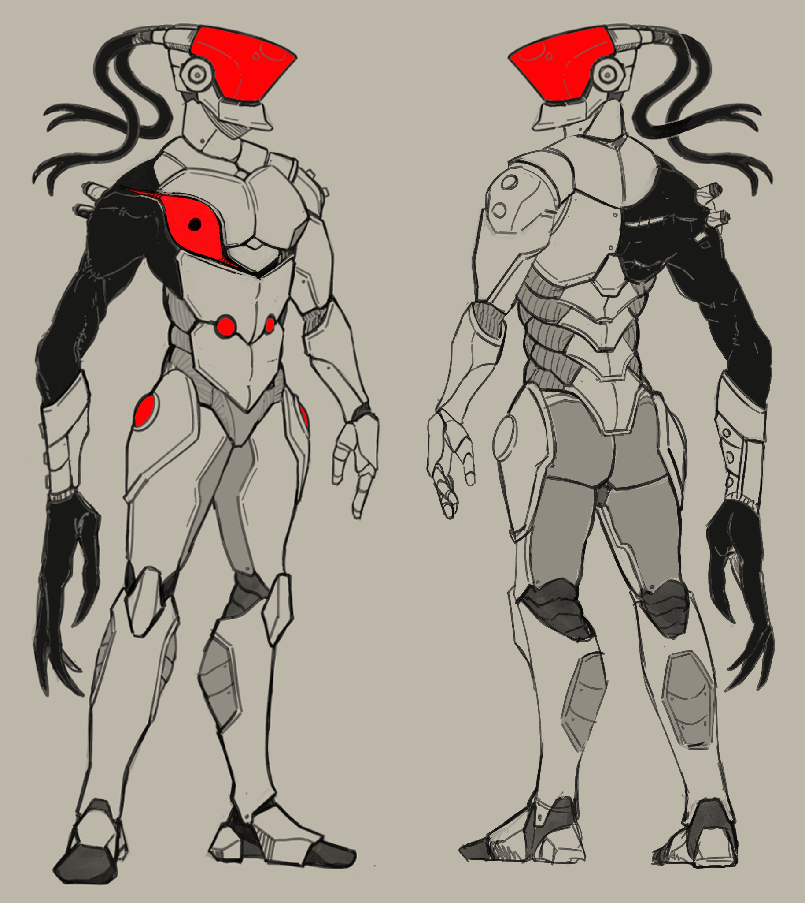

## Overview

A Japanese man is at the brink of death, and is brought back to life using cybernetics, only this time, he was also grafted with Imp parts. Now he has cybernetic ninja abilities and the power of Imps and it’s fuckin rad.

- Instead of shurikens it’s the darts that Imp Overlord throws
- Instead of simply dashing, he rips through space through the red plane and deals damage

New development: imp arm is still fuckin alive, reluctantly helping the guy go kill providence cause imps hate providence, but after learning he’s dead settle with killing mithrix

## Model

### 

- Stlll needs a weapon
- Possible Color reference
-  

## Abilities (Current Prototype)

Download [Faceless Joe](https://thunderstore.io/package/TheTimesweeper/Faceless_Joe/) and enable cursed config
- Pre SotS so idk how much of this is broken

Primary- Shurikens:
- Throw 3 shurikens. While sprinting, throw a fan of 3
    - You can sprint in all directions

Secondary - Deflect
- Deflect for a short duration, sending back projectiles, bullet attacks, and hard coded special case for golem lasers
    - Just makes you completely invincible. Not even taking direction into account

Utility - Dash
- Reset on kills and assists

Special - Dragonblade
- Pull out [dragon]blade and do big melee swipes with joe’s shitty hitboxes
- Built up by dealing damage like overwatch (cooldown is 20 “seconds” and doesn’t recharge automatically. “Time” only recharges when damage is dealt)

## Abilities (Planned)

Primary:
- Throw 3 shurikens while holding, throw 3 in a fan while mashing (see [Alien Hominid](https://thunderstore.io/package/TheTimesweeper/Alien_Hominid/) for how this feels)
    - Cut sprinting in all directions
- imp overlord darts instead of shurikens

Secondary:
- Hella needs networking
- I’m sure only deflecting in front of you would be best, but full invincible is easier and completely workable
- Current detection for projectiles is kinda shoddy (old Enforcer code). They should be detected when they impact the hurtbox, not detected by distance, as large projectiles will often not get deflected
- Bullet attacks that don’t have a tracer should be given a default red tracer
- Big area overlay

Utility:
- Basically done, just needs tuning
- Unsure if assist system is networked
- Weird red effect from imp teleporting but dashy

Special:
- Need to set stock to 0 in the skilldef OnAssigned
- Unsure if damage building up is networked
- Final slash shatters the blade (shatterspleen explosion)

Misc:
- Probably add bleed to utility, special, and maybe primary cause that’s a big thing about Imps.
- Not sure what to do about a blade. That’s missing from the concept
    - One idea is some kind of small energy sword used for deflecting, that gets amplified during “dragon”blade
    - Japanese influence is all but lost but could lean back on the katana/wakizashi combo
- Not sure what to final name. Was gonna go with Cyberninja but the ninja part’s all but gone
    - Cyborg is pretty taken, also too generic

### Alts
Alt Special - [X-Strike from Heroes of the Storm](https://youtu.be/-SJgvzPRFEI?si=_TMt_v4r0jrWREuV&t=136)
- Two big slashes in the ground in a big X, then slam down the full X
- Not built up by damage, if people want a more consistent non-ultimate special

Anything else you can think of!
## Animations

Main Animations
- Idle
- Run (fwd, left, right, back)
- Sprint
- Ascend/Descend
- Lobby (intro, idle)

Polish/Legitness
- Aim pitch, yaw
- idle in (suddenly stop running -> idle)
- jump up (very quick)
- landing impact (additive)(should start from the character's idle pose)

Optional
- Airborne lean poses (fwd, left, right, back, neutral)
- Sprint Left, Right

Skills
- Primary
    - Throw 3 darts in a row
    - Throw fan of 3 darts at once
- Secondary
    - Enter deflect hold up small blade with human arm
    - Deflect loop
    - Deflecting a small thing
    - Deflecting a big thing
    - Exit deflect (Sheathe blade?)
- Utility
    - dash claw swipe with big arm
- Special
    - Pull out blade:
        - Hold small blade in human arm
        - Take imp arm and jam it into the blade
        - Pull imp arm out, while the blood spilling out forms the full blade around the small blade
    - Upper body hold blade with human arm
    - Swing blade left and right with human arm
    - Final slash that shatters the blood part of the blade
    - Sheathe (?)
- Special Alt
    - [Good luck](https://youtu.be/-SJgvzPRFEI?si=_TMt_v4r0jrWREuV&t=136)